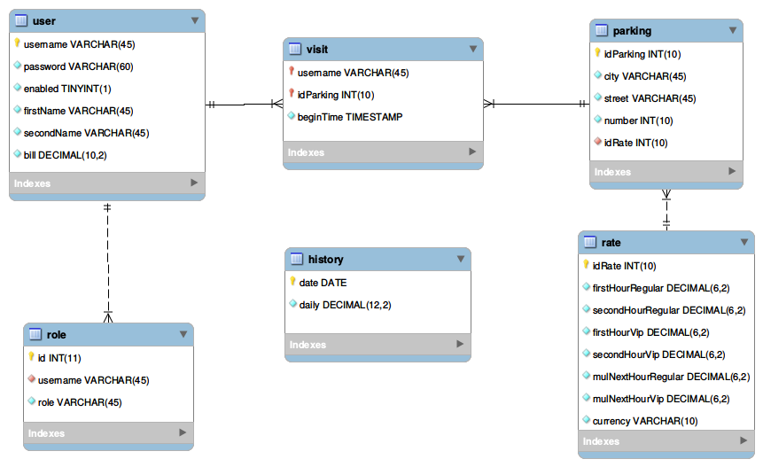

# ParkingManagement

## The problem
The customer wants to build a web application for managing the city parking spaces.

Tasks:
* design the API 
* create a model 
* implement customer's users stories

## User Stories
1. As a driver, I want to start the parking meter, so I don't have to pay the fine for the invalid parking.
2. As a parking operator, I want to check if the driver has started the parking meter.
3. As a driver, I want to stop the parking meter, so that I pay only for the actual parking time.
4. As a driver, I want to know how much I have to pay for parking.
5. As a parking owner, I want to know how much money was earned during a given day.

## Specification

### Security
The view is defined for 3 user types: **vip**, **regular** and **operator**.
The *owner* type is not formally defined, but the function checking how much
money was earned at a given day is implemented, therefore such a functionality
could be developed.

### Model

The webapp is executed on a server, so a hibernate module is included.

For testing purposes, however, mock services and database DAOs were implemented
([*src/main/java/mockObjects*](src/main/java/mockObjects)).

The real application lives on the [server](http://serve.bpointer.cloud).
You can log in using:

|Username|Password|
|--------|--------|
|vip     |pass    |
|operator|pass    |
|regular |pass    |

The creation of new users is not implemented,
as it is not required by the project scope.

The password hashes are stored in database for security purposes.

## Happy path scenarios for the vip and regular users

* Log in to the webapp using the above credentials
* The home page shows user account details, including the receipt info
* Go to 'parking list'
* Here, a list of all parking lots is shown and after clicking
the start button the parking meter is started
* After clicking the stop button the meter is stopped
and the parking fare is calculated based on an appropriate parking rate.
The parking rate for a chosen parking lot can be viewed
in the 'parking rates' section
* Log out by clicking the log out button

## Happy path scenarios for the operator
* Log in to the webapp using the above credentials
* The home page shows user account details
* Go to 'visits list'
* Here, all active visits are shown, ie. the list of actively parking users
and the parking lots where their meters were started
* Log out using the log out buton
